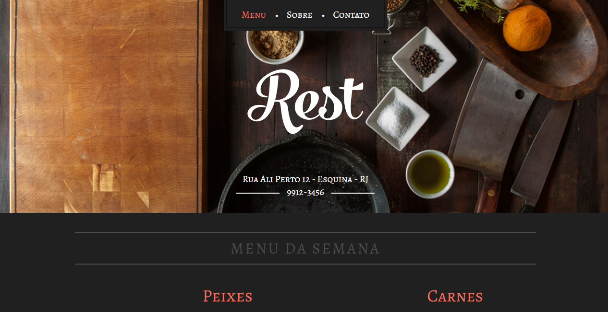

# Rest

Este site é um projeto desenvolvido utilizando o WordPress como CMS. Trata-se de um tema personalizado para um restaurante, com o objetivo de oferecer uma solução prática e intuitiva para a personalização do conteúdo. Os usuários podem facilmente modificar os textos do site, como descrições de pratos, informações de contato e horários de funcionamento, utilizando o plugin Advanced Custom Fields (ACF).

🚀 Linguagem utilizada: PHP

---

## Descrição do Projeto

O projeto consiste em um tema personalizado para um restaurante desenvolvido com o WordPress. Foi implementado o plugin Advanced Custom Fields (ACF), permitindo que os usuários realizem modificações nos textos do site de forma fácil e rápida. Os campos personalizados fornecidos pelo ACF permitem alterações em descrições de pratos, informações de contato e horários de funcionamento, proporcionando uma experiência personalizada para o restaurante.

Além disso, foram aplicadas práticas básicas de SEO, como a otimização de títulos e descrições, visando melhorar a visibilidade do site nos mecanismos de busca. O tema personalizado foi projetado com foco na facilidade de uso e personalização, destacando a identidade e as necessidades específicas do restaurante.

## Contato

Se você tiver alguma dúvida ou precisar de assistência adicional, fique à vontade para entrar em contato através do LinkedIn, Instagram ou por e-mail. As informações de contato estão disponíveis na minha página principal do GitHub.

---

👨‍💻 Criado por [rochamaatheus](https://github.com/rochamaatheus).
